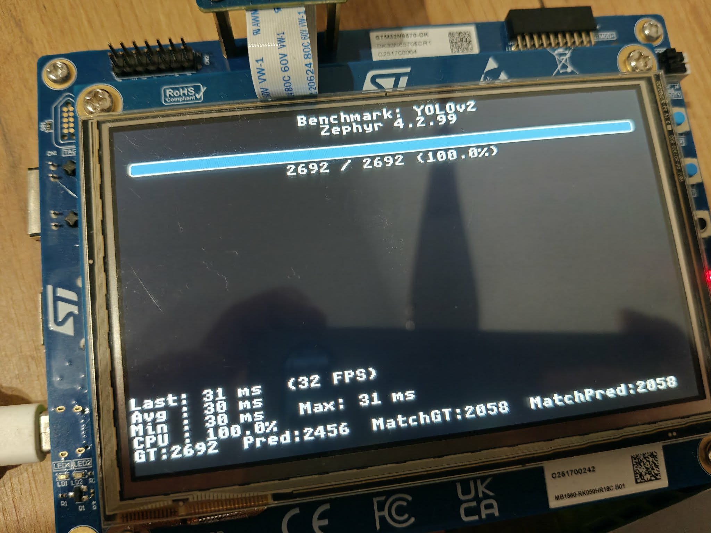
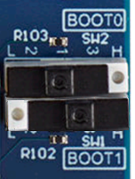

# AI Object Detection Benchmark Application for STM32N6 
---

# Install Application

The following commands show how to install and build this application, assuming that the [Zephyr SDK](https://docs.zephyrproject.org/latest/develop/toolchains/zephyr_sdk.html) and
[host tools](https://docs.zephyrproject.org/latest/develop/getting_started/index.html#install-dependencies) are installed:

```bash
$ mkdir workspace
$ cd workspace
workspace $ west init -m https://github.com/Magisterka-Adam/zephyr-stm32n6-ai-people-detection.git
workspace $ west update
```

---

# Build application

## Build application for development

```bash
workspace $ cd zephyr-stm32n6-ai-people-detection
workspace/zephyr-stm32n6-ai-people-detection $ west build app -p
```

## Build application to boot from flash

```bash
workspace $ cd zephyr-stm32n6-ai-people-detection
workspace/zephyr-stm32n6-ai-people-detection $ west build -b stm32n6570_dk  --sysbuild app -DSB_CONFIG_MCUBOOT_MODE_RAM_LOAD=y -p
```

---

# Flash application model weights

This needs to be done once (unless you update the model).
Set your board to [development mode](#boot-modes).
Ensure **no** `ST-LINK_gdbserver` is running

```bash
workspace/zephyr-stm32n6-ai-people-detection $ west flash-weights
```

---

# Prepare SD Card
Before running application prepare SD Card with images for format read by STM32N6. To do it read instruction from [README.md](dataset/README.md).

---

# Execute application

## When application is built for development

Set your board to [development mode](#boot-modes).

```bash
workspace/zephyr-stm32n6-ai-people-detection $ west debug
...
Transfer rate: 698 KB/sec, 6890 bytes/write.
(gdb) c
Continuing.
```

## When application is built to boot from flash

### Flash MCUboot and application

Set your board to [development mode](#boot-modes).
Ensure **no** `ST-LINK_gdbserver` is running.

```bash
workspace/zephyr-stm32n6-ai-people-detection $ west flash
```

### Start MCUboot and application

Set your board to [boot from flash](#boot-modes). Then perform a power off/on sequence.

Use `screen` to see logs from board
```bash
screen /dev/ttyACM0 115200
```

After running sequence your display should look like that:


---

# Boot Modes

The STM32N6 series does not have internal flash memory. To retain firmware after a reboot, program it into the external flash. Alternatively, you can load firmware directly
into SRAM (development mode), but note that the program will be lost if the board is powered off in this mode.

**Development Mode:** Used for loading firmware into RAM during a debug session or for programming firmware into external flash.

**Boot from Flash:** Used to boot firmware from external flash.

|                  |                                                                              |
| -------------    | -------------                                                                |
| Boot from flash  |  |
| Development mode |        |
